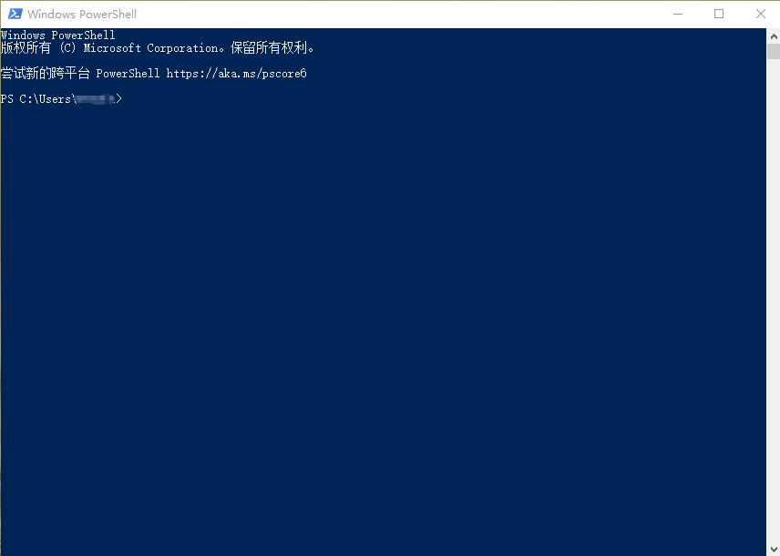
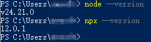
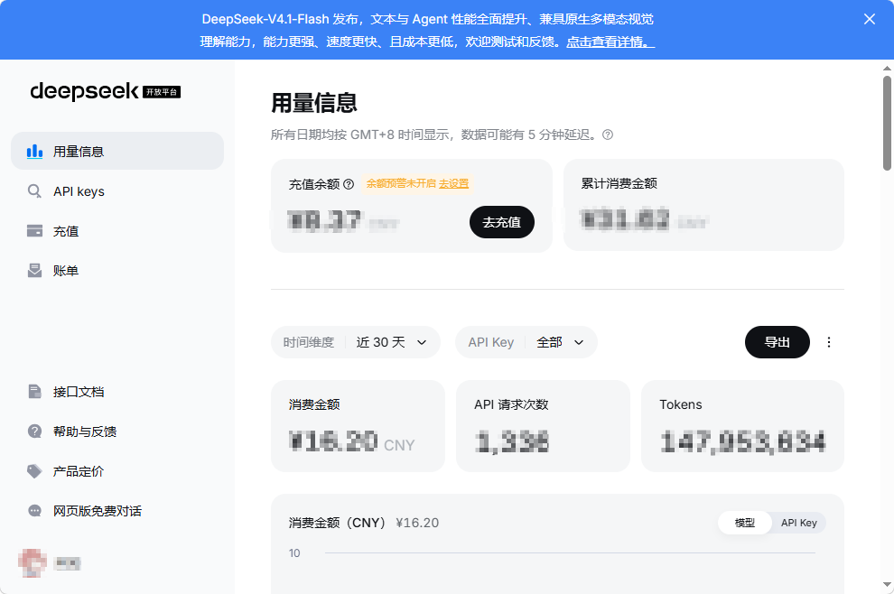

> 使用deepseek harness肯定是要给deepseek充钱的！我们最后一步再决定充不充！

> 开始使用deepseek harness仅需要极短的步骤，门槛极低，电脑小白也能看得懂

> 仅面向windows用户（非苹果电脑）

1. 如何安装node
2. 如何使用powershell
3. 如何安装dsh（deepseek harness）
4. 充钱获取api-key

## 安装node
点击下面链接直接下载，然后使用默认选项，一路确认安装就行了
https://nodejs.org/dist/v24.21.0/node-v24.21.0-x64.msi

## powershell

### 如何打开powershell
1. 用鼠标点击电脑屏幕底部任务栏中的搜索框，如图

2. 用键盘输入powershell，敲回车
3. 打开了powershell窗口，如图


### 如何使用powershell
在刚才打开的powershell窗口，敲上
```bash
node --version
```
然后回车，正常情况就会打印出版本信息，这里再敲上
```bash
npx --version
```
只要这里正常显示版本号，就没问题，如图


## 安装并打开dsh
继续再刚才的powershell窗口敲下：
```bash
npx @deepseek-ai/dsh web
```
等几分钟就好了，中间会出现问句，例如：
```bash
Ok to proceed?(y)
```
按照指示敲一个字母y然后回车就行了。
然后会弹出来一个网页，要求你输入api-key，这个时候就需要你充钱获取了。（注意！这里可以暂时不动了，下一步获取api-key后直接粘贴过来）

## 给deepseek充钱
https://platform.deepseek.com/  
页面很简单，如图

在充值栏冲几块钱试试，然后在api-keys栏生成api-key，要记住，它让你复制的时候一定要复制，关掉之后就没法复制了，复制下来回到dsh的页面粘贴过去就好了

## 恭喜
你已经可以使用dsh了，关于如何使用以及更好的使用，还有很长的路要走。
