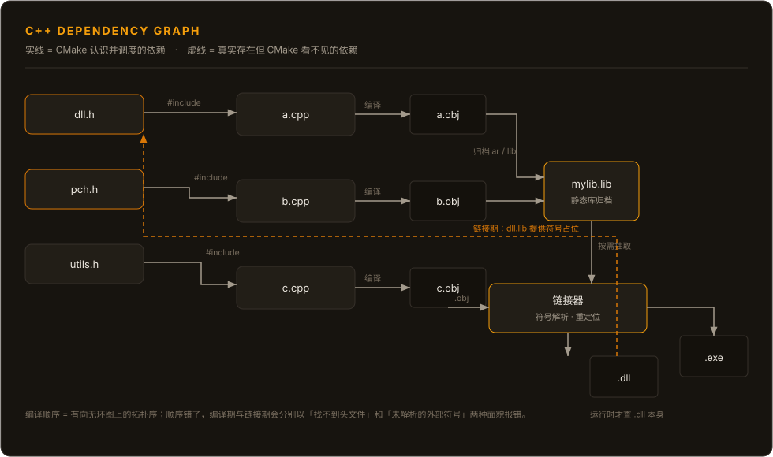

一个 C++ 工程里有**两张依赖图**：

1. **文件级**：`.cpp` / `.h` 之间的 include 关系。只有编译器认识它。
2. **目标级**：CMake target 之间的 `target_link_libraries` 关系。只有构建系统认识它。

两张图描述的是同一件事的不同侧面，但**没有任何工具会替你检查它们是否一致**。这个缝隙就是绝大多数「编译报找不到头文件」和「链接报未解析的外部符号」的真正来源：前者是文件级顺序错了，后者是目标级顺序错了，而它们看起来都像"依赖没配好"。

本文以**依赖关系与编译顺序**为主线，把它们拆开讲清楚。

---

## 一、TU：唯一的编译单位

### 编译器从未见过你的 .cpp

C++ 编译的第一步是预处理：把 `#include` 原地展开成文本。`#include` 是**文本替换**，不是导入、不是链接、没有任何符号语义。

```bash
# 只看预处理结果，不编译
g++ -E src/a.cpp -o a.ii
cl /P /Fi a.i src/a.cpp
```

输出的 `a.ii` 是一个**自包含的纯文本**：所有头文件都被展开了，宏都替换了，条件编译都裁掉了。这就是一个 **translation unit（TU，翻译单元）**。

所以严格地说：

> **TU = 一个源文件 + 它递归包含的全部头文件 + 当时的宏定义，经过预处理后的结果。**

编译器看到的是 TU，不是 `.cpp`。这意味着：

- **一个 `.cpp` 恰好对应一个 TU。**（这条几乎是定义）
- **同一份头文件在 N 个 TU 里被复制了 N 份。** 每个 TU 都是独立编译的，彼此不知道对方存在。
- **宏是 TU 局部的。** `-DNDEBUG` 只影响它所在的那次编译。
- **头文件里的 `#if` 分支不同，就是不同的 TU。** 同一个 `foo.h`，在 A 里展开出 Debug 版本，在 B 里展开出 Release 版本——编译器不认为这有什么问题，直到链接器发现两个 `foo` 符号。

`#pragma once` / include guard 只解决**单个 TU 内的重复展开**，对跨 TU 的重复毫无作用。这是新手最容易误解的一点。

### ODR 是从哪里冒出来的

既然头文件内容被复制进每个 TU，那头文件里的函数定义就会在每个 TU 里出现一次。C++ 用 **ODR（One Definition Rule，单一定义规则）** 处理这件事：

| 头文件里放什么 | 链接期后果 |
|---|---|
| 声明（函数原型、`extern` 变量、类定义） | 无符号产生，安全 |
| `inline` 函数、模板、类内定义的成员函数 | 产生**弱符号**，链接器合并，只保留一份 |
| 普通函数定义、非 `extern` 的全局变量 | 产生**强符号**，多个 TU 同时有 → `multiple definition` |

链接器对弱符号的处理是"任选一份"。如果这些副本实际内容不一致（比如受宏影响），**编译器不会报错，链接器也不会报错**，行为未定义——这就是经典的 ODR violation。它通常表现为"某些 TU 里行为正常，另一些 TU 里不正常"。

---

## 二、编译产物：obj、lib、dll 各是什么

```bash
# Windows / MSVC
cl /c /EHsc src\a.cpp /Fo build\a.obj     # 编译，不链接
link a.obj b.obj /OUT:app.exe

# Linux / GCC
g++ -c src/a.cpp -o build/a.o
g++ a.o b.o -o app
```

| 产物 | Windows | Linux | 内容本质 |
|---|---|---|---|
| 目标文件 | `.obj` | `.o` | **可重定位**的机器码 + 符号表 + 重定位表 |
| 静态库 | `.lib` | `.a` | 一堆 `.obj` 的**归档**（archiver 打的包，`lib` / `ar`） |
| 导入库 | `.lib` | —— | 只有**符号占位**，函数体在 DLL 里 |
| 动态库 | `.dll` | `.so` | 可直接加载的模块，含代码 + 导出符号表 |
| 可执行 | `.exe` | 无后缀 | 同上，外加入口点 |

**目标文件的定义性特征是重定位（relocation）未完成**：机器码里调用外部函数的位置是空洞，旁边记着"这里要填 `foo` 的地址"。符号表则记录三件事：

- 我**定义**了哪些符号（`T`/`D`：text/data）
- 我**引用但没定义**哪些符号（`U`：undefined）
- 哪些是弱符号（`W`/`V`）

链接器的工作就是：收集所有 `.obj` 的定义，把每个 `U` 匹配到一个定义，然后回填那些空洞。

### 一个关键区别：导入库 vs 动态库本体

这是 Windows 上最容易被忽略的一层：

- **链接一个 DLL 时，你链接的不是 `.dll`，而是它的导入库 `.lib`。**
- 导入库里的符号是**跳转桩**（stub），不是真正的函数体。
- 编译 `.dll` 的那次 link，除 `.dll` 外会**同时产出**这个导入库。
- 最终解析发生在**加载期**：PE 加载器读导入表，按名字在磁盘上找 `.dll`，填 IAT（Import Address Table）。

推论：**链接通过 ≠ 能运行**。导入库在，链接器就满足；`.dll` 不在，程序启动/调用时才炸。反过来，`.dll` 在磁盘上但没有对应的导入库，你连链接都过不去。

Linux 这边没有导入库这个概念：`.so` 自身既含代码也含符号表，链接期用它、运行期也用它。GNU ld 还有个 `--as-needed` 默认行为，会影响最终 DT_NEEDED 里到底记不记这个库。

### 导出：Windows 多出来的一道手续

Windows 上 DLL 的符号**默认不导出**，必须显式声明：

```cpp
// dll.h —— 经典的导出宏
#ifdef MYLIB_EXPORTS
#  define MYLIB_API __declspec(dllexport)
#else
#  define MYLIB_API __declspec(dllimport)
#endif

MYLIB_API int compute(int x);
```

- `dllexport`：告诉链接器把这个符号放进 `.dll` 的导出表。
- `dllimport`：告诉编译器"这个符号在别的模块里"，让它生成**少一层间接跳转**的调用代码。
- **同一个头文件，在编译 DLL 自己时是 `dllexport`，在编译使用者时是 `dllimport`** —— 靠 `MYLIB_EXPORTS` 这类宏切换，通常由 `target_compile_definitions` 在构建 DLL 的 target 上定义。

Linux 默认全部符号可见，所以同一段代码不加任何宏也能编过、也能链接，这是跨平台移植时最常见的意外。

> 顺带说清一个常被混淆的点：`dllimport` / `dllexport` 解决的是**跨模块符号可见性**；下面的 `PUBLIC` / `PRIVATE` 解决的是**依赖传递**。两者正交，都得配。

---

## 三、CMake target：构建计划的最小单元

CMake 的抽象是：**target 是构建计划的最小单元，而不是文件。**

```cmake
add_library(mylib STATIC  src/a.cpp src/b.cpp)
target_include_directories(mylib PUBLIC include)
target_compile_features(mylib PUBLIC cxx_std_20)
target_link_libraries(mylib PUBLIC  fmt::fmt      # 用它的符号，也要传递它的要求
                             PRIVATE spdlog)      # 只在内部用，不传递给下游
```

一个 target 承载四类信息：

| 类别 | 属性 | 作用 |
|---|---|---|
| 输入 | `SOURCES` | 从哪些 `.cpp` 编出 TU |
| 编译配置 | `INCLUDE_DIRECTORIES`、`COMPILE_DEFINITIONS`、`COMPILE_FEATURES` | 影响 TU 的内容 |
| 依赖 | `LINK_LIBRARIES` | 链接期找谁要符号 |
| 使用要求 | `INTERFACE_*` | 自己把自己"怎么被用"描述给下游 |

### 关键词传播规则

`target_link_libraries` 的三个关键词，本质是**这张表往哪个方向传播**：

| 关键词 | 我自己**链接**它 | 下游**继承**它 | 典型用途 |
|---|---|---|---|
| `PRIVATE` | ✅ | ❌ | 实现细节：日志库、内部工具 |
| `PUBLIC` | ✅ | ✅ | 出现在我的**公开头文件**里的依赖 |
| `INTERFACE` | ❌ | ✅ | header-only 库、编译选项、导出宏 |

判据只有一条，且很好记：

> **这个依赖出现在我对外暴露的头文件里吗？**
> 出现 → 至少 `PUBLIC`（如果我自己不需要链接它，就是 `INTERFACE`）。
> 不出现，只在 `.cpp` 里用 → `PRIVATE`。

`INTERFACE` 库因此可以是一个**没有源文件、只承载要求**的 target，`find_package` 导出的现代包（`fmt::fmt`、`Qt6::Core`）都是这种。

**传播是传递闭包**：A → B → C，只要 B 对 C 是 `PUBLIC`/`INTERFACE`，A 拿到 B 的同时也拿到 C 的 include 路径、宏和链接项。这就是为什么"我只链接了一个库，命令行上却出现了一长串 `-l`"。

### 依赖驱动顺序，而顺序有方向

目标级依赖图是有向图，构建顺序是它的**拓扑序**。方向单一：被依赖者先构建。

```cmake
target_link_libraries(app PRIVATE mylib)   # 蕴含：先构建 mylib，再构建 app
```

这条 `target_link_libraries` 一句话同时表达了两件事：

1. **构建顺序**：`mylib` 必须先于 `app` 完成。
2. **链接输入**：链接 `app` 时把 `mylib` 传进去。

顺带一个静态库的便利：静态库是**归档**，链接器在最终链接时才按需从中抽取 `.obj`。所以静态库之间没有"运行期"关系，也不需要在很早期就完整存在（只是 CMake 仍会按拓扑序构建它）。动态库则必须在消费者链接之前就**链接完成**（因为要先生成导入库）。

---

## 四、全链路：从 TU 到可执行



把上图拆成阶段，每一列都是一次**独立的重建判断**：

| 阶段 | 输入 | 工具 | 输出 | 依赖判定依据 |
|---|---|---|---|---|
| 预处理 | `.cpp` + 头文件 + 宏 | 编译器前端 | TU（`.ii`） | 头文件列表（`.d`） |
| 编译 | TU | 编译器后端 | `.obj` | 源文件、头文件、编译选项 |
| 归档 | 若干 `.obj` | `ar` / `lib` | `.lib` / `.a` | 成员 `.obj` 的时间戳 |
| 链接 | `.obj` + 库 | 链接器 | `.exe` / `.dll` + 导入库 | 全部链接输入 |
| 加载 | `.exe` + `.dll`/`.so` | OS 加载器 | 运行中的进程 | 导入表 + 搜索路径 |

**顺序失控的症状按阶段分层，这是最有用的一条经验：**

| 出错阶段 | 报错样貌 | 说明 |
|---|---|---|
| 预处理 | `fatal error: xxx.h: No such file` / `C1083` | 头文件顺序或 include 路径问题 |
| 编译 | 语法/类型错误、宏没定义 | TU 内容不对 |
| 链接 | `undefined reference to foo` / `LNK2019` | **声明有了，定义没找到** |
| 链接 | `multiple definition` / `LNK2005` | **定义有了，但不止一份** |
| 加载 | 启动失败、`找不到 xxx.dll` / `error while loading shared libraries` | 库文件不在运行时搜索路径上 |

"链接期错误"和"编译期错误"的根本区别在于**依赖对象不同**：

- 编译期依赖的对象是**文件**（头文件）。要求：编译这个 TU 之前，这些文件必须存在且内容正确。
- 链接期依赖的对象是**符号**。要求：链接这个 target 之前，提供这些符号的**产物**必须已经生成。

---

## 五、编译期依赖：文件级

### 依赖是递归闭包

`a.cpp` 依赖 `a.h`，`a.h` 依赖 `base.h`，那么 `a.cpp` 的 TU 也依赖 `base.h`。**改 `base.h` 会导致 `a.obj` 重建**，无论 `a.cpp` 或 `a.h` 是否变过。

这就是 `README.md` 里烂大街的"修改一个头文件导致全量重编译"。计算量不是重点，重点是**扇出**：一个被 N 个 TU 包含的公共头，改动它的代价是 N 次编译。

于是编译成本可以粗略写成：

> **总编译时间 ≈ Σ(TU 的规模) ，而 TU 的规模 = 该 TU 包含闭包展开后的 token 数**

两个直接推论：

- **PCH（预编译头）有效**，是因为它把依赖图里**最稳定、扇出最大**的那部分（标准库、第三方库头）固化成了二进制快照，让每个 TU 不必重新解析。
- **前向声明/`pimpl` 有价值**，是因为它把"头文件闭包"从**实现依赖**缩成了**接口依赖**。这也是 IWYU 这类工具存在的意义。

### 编译器怎么把这份依赖交给构建系统

构建系统不可能自己解析 C++ 的 `#include`（宏和条件编译让它做不到）。所以走的是"编译时顺手生成依赖文件"的路子：

```bash
# GCC/Clang：编译的同时生成 .d
g++ -MMD -MF build/a.d -c src/a.cpp -o build/a.o

# MSVC：把包含的每个头打成 stdout，由构建系统解析
cl /c /showIncludes src\a.cpp /Fobuild\a.obj
```

`build/a.d` 里是标准的 Makefile 依赖规则：

```make
build/a.o: src/a.cpp include/a.h include/base.h \
  /usr/include/c++/12/vector /usr/include/c++/12/bits/stl_vector.h
```

**Ninja 会读这个 `.d`**，从而知道"`base.h` 变了要重建 `a.obj`"——这就是为什么改动一个头文件，`ninja` 能精确地只重编受影响的 TU，而不是全量。

这套机制还解释了日常现象：

- 第一次构建是**全量**（还没有 `.d`），之后的增量才精确。
- `.d` 不参与版本控制，但要跟 `.obj` 一起放在 build 目录里；删掉 `.d` 而留着 `.obj` 会得到**过期的增量结果**。

### 可复现性与缓存

既然头文件是 TU 的一部分，那**编译缓存（ccache / sccache）的键**就不只是源文件哈希，而是"预处理后的 TU + 编译选项 + 编译器版本"。所以：

- 改一个被广泛包含的头，缓存命中率会整体下降——这是设计使然，不是缓存失效。
- `-D` 宏变化会让缓存全部 miss。
- 路径出现在 `__FILE__`、debug info 里，所以**构建目录要稳定**，否则可复现构建做不到。

---

## 六、链接期依赖：符号级

### 链接器在做什么

链接器做两件事：

1. **符号解析**：把每个 `U`（未定义）匹配到一个定义。
2. **重定位**：把机器码里的空洞填上最终地址。

静态库的处理方式是**按需抽取（按需加载）**：链接器只从 `.a` / `.lib` 里拿出**当前还需要**的 `.obj`。这个策略是很多"玄学"的根源。

### 静态库顺序为什么重要

GNU ld 从左到右**单遍**扫描，并维护两个集合：已定义符号、仍未定义符号。

```bash
# 这样能过
g++ main.o libfoo.a libbar.a -o app

# 这样可能报 undefined reference to bar_fn
g++ main.o libbar.a libfoo.a -o app
```

原因：扫到 `libbar.a` 时，没人引用 `bar_fn`，**它就被跳过了**；后面 `libfoo.a` 需要 `bar_fn`，但 `libbar.a` 已经扫完，不会再回头。

处理办法有优先级之分：

| 手段 | 评价 |
|---|---|
| 调整顺序 / 重复库 | 能过，但脆弱，顺序依赖成了隐式契约 |
| `--start-group ... --end-group` | GCC/Clang 下让 ld 迭代扫描直到收敛，显式且局部 |
| MSVC `/WHOLEARCHIVE` | 强制整包引入，代价是体积和重复符号风险 |
| **用 CMake 的 target 依赖表达** | ✅ 首选：让 CMake 生成正确顺序，而不是手工排序 |

CMake 从 3.24 起提供 `$<LINK_GROUP:RESCAN,...>` 来表达"这组库之间有循环引用"，比手写 `-Wl,--start-group` 更可移植。但**构建顺序上的循环是另一回事**——如果两个 target 互相依赖对方的 include 路径，那必须靠抽接口或拆库来真正解开，不能靠链接器兜底。

### 符号可见性、ABI 与名称修饰

- **名称修饰（name mangling）**：C++ 符号名里编码了命名空间、参数类型、CV 限定。所以：
  - `extern "C"` 关掉修饰——这是 C 接口能被其他语言调用的前提。
  - **不同编译器 / 不同版本修饰规则不同**，跨编译器链接 C++ 基本不可行。
  - 同类还有标准库 ABI 开关（如 `_GLIBCXX_USE_CXX11_ABI`），不匹配就得到一屏 `undefined reference`，且看起来毫无道理。
- **弱符号与 ODR**：`inline`、模板实例化产物是弱符号，链接器合并。多个 TU 里的弱符号**内容不一致**时，链接器不报错——这是上一节 ODR violation 的链接期表现。
- **`-fvisibility=hidden`**：Linux 上主动收敛导出面，既减体积也减 ABI 暴露面。Windows 上对应的是默认不导出（所以必须写 `dllexport`）。

一句话对比两个平台的心智模型：

> **Windows：默认不导出，跨模块必须显式声明。**
> **Linux：默认全导出，跨模块"能连上"不代表你打算连。**

---

## 七、构建顺序是怎么定下来的

把前面几节合起来，构建顺序其实由**三个独立机制**叠加决定。分清这三层，绝大多数"顺序问题"就不用猜了。

### 1. CMake：目标级拓扑排序

```cmake
add_library(mylib src/a.cpp src/b.cpp)
add_executable(app src/main.cpp)
target_link_libraries(app PRIVATE mylib)
```

CMake 生成的构建文件中，`app` 依赖 `mylib`——这是**目标级**依赖。它保证：

- 链接 `app` 时，`mylib` 已经构建完成；
- 传给 `app` 的链接输入里包含 `mylib`；
- `mylib` 的 `PUBLIC` include 路径出现在编译 `main.cpp` 的命令行里。

`add_dependencies()` 同样只表达**构建顺序**，不表达链接。所以：

> `target_link_libraries` = 顺序 **+** 链接输入
> `add_dependencies` = **只有**顺序

分不清这两者，就会出现"顺序对了，但还是链接失败"。

### 2. 编译器后端：文件级依赖

`.d` / `/showIncludes` 提供"`a.obj` 依赖哪些头文件"。构建系统据此决定**单个 target 内部**哪些 `.obj` 需要重建。

### 3. 调度器：并行执行

Ninja / MSBuild 拿到上面两张图后，并行执行没有依赖关系的节点。

```bash
ninja -j 16          # 一般取核数到 1.5×核数
ninja -d explain     # 解释每条边为什么被判定为过期
ninja -t deps        # 列出每个 .obj 的真实头文件依赖
ninja -t graph       # 输出依赖图的 Graphviz 文本
ninja -t query a.obj # 查这个节点为何被重建
```

**CMake 只能管到第 1 层。** 第 2 层交给编译器，第 3 层交给 Ninja。任何"CMake 应该知道源文件之间谁在前"的期待都是错的——CMake 不知道，也不打算知道。

### 关于 C++20 模块

上面整套"文件级依赖靠编译器补齐"的机制，是**文本包含模型的补丁**。C++20 的模块换了模型：模块接口在编译时产出 BMI（已编译模块接口），依赖关系由编译器在**语义层面**确定，而不是靠头文件时间戳。

```cmake
target_sources(mylib PUBLIC FILE_SET CXX_MODULES FILES src/mylib.cppm)
```

但要注意：**target 级的依赖关系不会因为用了模块而消失**。CMake 仍然需要知道模块属于哪个 target、谁依赖谁，只是文件级那一层不再靠 `.d` 猜。这也是当前模块化落地慢的原因之一——工具链支持参差，构建系统的支持更晚。

---

## 八、常见坑清单

| 症状 | 真正的原因 | 处理 |
|---|---|---|
| 改了头文件但没重新编译 | `.d` 没生成 / 被删 / Ninja 的 deps 日志丢了 | 检查 `-MMD -MF`（GCC）或 `/showIncludes`（MSVC）；`ninja -t deps` 验证 |
| 编译过，链接报 `undefined reference` | 声明在手（头文件）而定义不在（库没链接 / 顺序错 / 修饰不匹配） | 看 `nm`；确认 target 依赖；检查 ABI 与 `extern "C"` |
| 链接过，运行报找不到 DLL | 链接用的是导入库，运行要的是 DLL 本体 | 部署 `.dll`；Windows 的搜索路径与 Linux 完全不同 |
| `multiple definition` / `LNK2005` | 头文件里放了非 `inline` 的函数/变量定义 | 加 `inline`、改 `static`、或移进 `.cpp` |
| 下游莫名其妙找不到我依赖的头 | 依赖写成了 `PRIVATE`，但它出现在我的公开头里 | 改成 `PUBLIC` |
| Debug/Release 混用后行为诡异 | 宏不同 → 不同 TU 里的类布局/内联体不同 → ODR violation | 统一配置；不要混链接不同配置的库 |
| 循环依赖，CMake 直接报错 | 目标级依赖真有环 | 抽 `INTERFACE` 库、拆目标、或把公共部分下沉 |
| 并行构建偶发失败，`-j1` 就好 | 隐式编译期依赖，靠"构建顺序碰巧对"在工作 | 把依赖显式化；查 `.d` 是否完整 |

最后一条值得单独强调：

> **`-j1` 能修好的问题，都是依赖没声明清楚的问题。**
> 并行只是把隐式的依赖错误暴露出来而已。

---

## 九、速查

| 想做什么 | 怎么看 |
|---|---|
| 看一个 TU 到底长什么样 | `g++ -E a.cpp` ／ `cl /P /Fi a.i a.cpp` |
| 看头文件包含链 | `g++ -H -c a.cpp`（`-H` 打印 include 树） |
| 看 obj 里的符号 | `nm -C a.o` ／ `dumpbin /symbols a.obj` |
| 只看未定义符号 | `nm -C -u a.o` |
| 看库提供了什么符号 | `nm -C --defined-only libfoo.a` |
| 看可执行依赖哪些动态库 | `ldd app` ／ `dumpbin /dependents app.exe` |
| 看真实头文件依赖 | `ninja -t deps` ／ 打开 `build/a.d` |
| 看 target 依赖图 | `cmake --graphviz=deps.dot <build 目录>`，再用 Graphviz 渲染 |
| 看一个 target 的完整编译/链接命令 | `ninja -t commands <target>` |
| 排查"为什么又重编了" | `ninja -t query <输出>`、`ninja -d explain` |

---

## 一句话收束

> **文件级依赖由编译器发现（`.d`），目标级依赖由 CMake 声明（`target_link_libraries`），符号级依赖由链接器解决（顺序敏感）。**
> **编译顺序是这三张图叠加后的拓扑序。报错的样子取决于顺序在哪一层错了——"找不到头文件"和"未解析的外部符号"从来是两回事。**
